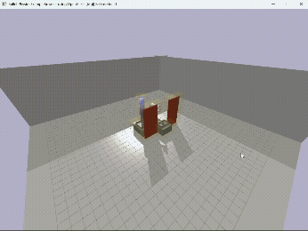

# Predicting Spatial Proximity Risk from Confined Robot Workspace Layouts

This repository contains the public code accompanying the paper:

**Predicting a Simulation-Derived Spatial Proximity Risk Indicator from Layout Images of a Confined Robot Workspace**

The code reproduces the PyBullet simulation dataset, trains ResNet-18 and ViT-Tiny regression models, evaluates the trained models on the additional C0-C4 evaluation set, and regenerates the paper figures from saved experiment outputs.

## Simulation Demo

A short PyBullet simulation demo is provided to illustrate the confined-workspace pick-and-place task and the spatial proximity risk grid.

<p align="center">
  
</p>

## Repository Contents

```text
.
|-- scripts/
|   |-- franka_simulation.py
|   |-- franka_paper_scene.py
|   |-- batch_generate_dataset.py
|   |-- generate_additional_evaluation_dataset.py
|   |-- run_hyperparameter_search.py
|   |-- run_multi_seed_training.py
|   |-- run_additional_evaluation.py
|   |-- make_paper_figures.py
|   `-- validate_public_release.py
|-- data/
|   `-- README.md
|-- models/
|   `-- README.md
|-- outputs/
|-- requirements.txt
`-- .gitignore
```

Large datasets and trained checkpoints are distributed through GitHub Releases, not committed directly to the repository.

## Release Assets

Download the following files from the repository's GitHub Releases page:

```text
generated_dataset.zip
additional_evaluation_dataset.zip
trained_models.zip
```

Expected extracted structure:

```text
data/
|-- generated_dataset/
|   |-- trial_summary_all.csv
|   `-- layout_images/
|       |-- layout_000_trial_000.npy
|       `-- ...
`-- additional_evaluation_dataset/
    |-- additional_evaluation_dataset.csv
    `-- layout_images/
        |-- layout_...
        `-- ...

outputs/
`-- multi_seed_training/
    |-- seed_42/
    |   |-- resnet18_layout_risk.pt
    |   `-- vit_tiny_layout_risk.pt
    |-- seed_43/
    |   |-- resnet18_layout_risk.pt
    |   `-- vit_tiny_layout_risk.pt
    `-- seed_44/
        |-- resnet18_layout_risk.pt
        `-- vit_tiny_layout_risk.pt
```

The CSV column `layout_image_path` should use relative paths such as:

```text
layout_images/layout_000_trial_000.npy
```

## Environment

Python 3.10 or newer is recommended. A GPU is recommended for model training and Score-CAM figure generation.

```bash
python -m venv .venv
source .venv/bin/activate
pip install -r requirements.txt
```

On Windows PowerShell:

```powershell
python -m venv .venv
.\.venv\Scripts\Activate.ps1
pip install -r requirements.txt
```

## Data Setup

After downloading the release assets, extract them into the repository root.

Linux/macOS:

```bash
unzip generated_dataset.zip -d data/
unzip additional_evaluation_dataset.zip -d data/
mkdir -p outputs/multi_seed_training
unzip trained_models.zip -d outputs/multi_seed_training/
```

Windows PowerShell:

```powershell
Expand-Archive generated_dataset.zip data -Force
Expand-Archive additional_evaluation_dataset.zip data -Force
New-Item -ItemType Directory -Force outputs/multi_seed_training
Expand-Archive trained_models.zip outputs/multi_seed_training -Force
```

Validate the extracted files:

```bash
python scripts/validate_public_release.py
```

To build the three zip files for a GitHub Release from local data and model
folders, run:

```bash
python scripts/build_release_archives.py
```

The archives are written to:

```text
release_assets/
```

## Main Workflow

### 1. Generate the simulation dataset

```bash
python scripts/batch_generate_dataset.py --yes
```

By default, outputs are written to:

```text
outputs/generated_dataset/
```

For model training with the default paths, place or copy the final public dataset under:

```text
data/generated_dataset/
```

### 2. Generate the additional evaluation dataset

```bash
python scripts/generate_additional_evaluation_dataset.py --yes --save-layout-images
```

By default, outputs are written to:

```text
outputs/additional_evaluation_dataset/
```

For evaluation with the default paths, place or copy the final public dataset under:

```text
data/additional_evaluation_dataset/
```

### 3. Run hyperparameter search

```bash
python scripts/run_hyperparameter_search.py
```

Outputs are saved under:

```text
outputs/hyperparameter_search/
```

### 4. Train final multi-seed models

```bash
python scripts/run_multi_seed_training.py
```

The default training seeds are `42,43,44`. Outputs are saved under:

```text
outputs/multi_seed_training/
```

### 5. Evaluate trained models on the additional evaluation dataset

```bash
python scripts/run_additional_evaluation.py
```

This generates prediction and metric CSV files under:

```text
outputs/additional_evaluation/
```

Wilcoxon signed-rank tests are optional and are not generated by default:

```bash
python scripts/run_additional_evaluation.py --run-wilcoxon
```

### 6. Regenerate paper figures

```bash
python scripts/make_paper_figures.py
```

Outputs are saved under:

```text
outputs/paper_figures/
```

To generate only selected figures:

```bash
python scripts/make_paper_figures.py --figures category_summary,trend_summary,risk_level_summary
python scripts/make_paper_figures.py --figures scorecam
```

## Notes on Reproducibility

The trained checkpoints are provided because GPU kernels, library versions, and hardware can introduce small numerical differences during training. The released checkpoints should be used when reproducing the reported evaluation and Score-CAM figures exactly.

The dataset images are stored as NumPy arrays (`.npy`) and referenced from CSV files by relative path. This avoids machine-specific local paths and keeps the release portable.
